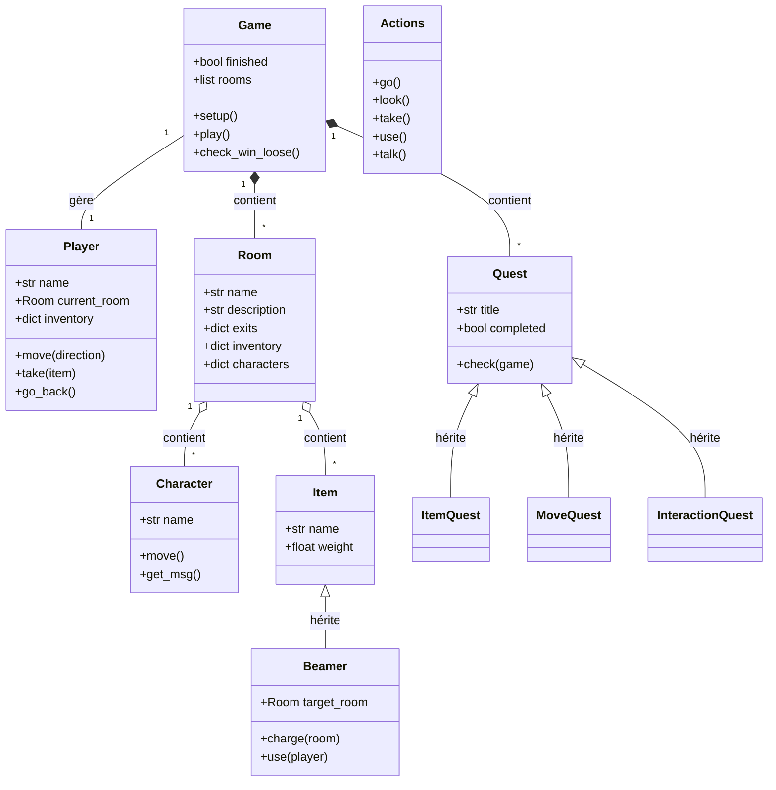

# ⚽ Inazuma Eleven : PROJET TBA

Raphael Anzalone , Natanael Consilvio

Bienvenue dans le dépôt de **Inazuma Eleven**, un jeu d'aventure textuel développé en Python. Ce projet reprend l'univers du manga de football Inazuma Eleven.

## 📖 Guide Utilisateur

### 1. Installation et Lancement

Pour jouer, vous devez avoir **Python** installé sur votre machine.

1. Téléchargez ou clonez ce dépôt.
2. Ouvrez un terminal dans le dossier du projet.
3. Lancez le jeu avec la commande suivante :
   ```bash
   python game.py
   ```

### 2. Description de l'Univers

Vous incarnez un nouveau joueur de l'équipe du collège **Raimon**. Le capitaine, **Mark Evans**, compte sur vous. Le match décisif contre l'académie **Kirkwood** est imminent, mais l'équipe n'est pas prête.
Votre mission : explorer le campus, rassembler des informations vitales et dénicher des informations qui assureront la victoire.

### 3. Conditions de Victoire et de Défaite

* **🏆 VICTOIRE :** Vous devez accomplir les 3 quêtes principales :
    1. Parler au capitaine Mark.
    2. Récupérer le manuel.
    3. Vous rendre chez l'ennemi (Kirkwood) et espionner le club adverse.
       
* **☠️ DÉFAITE :** Si vous entrez au **Club Kirkwood** sans avoir récupéré le **carnet** d'espionnage (situé dans la zone de recrutement), vous serez immédiatement repéré et expulsé du collège (Game Over).

### 4. Guide des Commandes

Le jeu se joue entièrement au clavier via des commandes textuelles.

| Catégorie | Commande | Description |
| :--- | :--- | :--- |
| **Mouvements** | `go <direction>` | Se déplacer (N, S, E, O, U, D). *Ex: `go N`* |
| | `back` | Revenir à la pièce précédente. |
| | `history` | Afficher la liste des lieux visités. |
| **Téléportation** | `charge` | Mémoriser la pièce actuelle dans le **Beamer**. |
| | `use beamer` | Se téléporter instantanément au point mémorisé. |
| **Exploration** | `look` | Observer la pièce, voir les objets et les PNJ. |
| | `talk <nom>` | Parler à un personnage. *Ex: `talk Mark`* |
| **Inventaire** | `take <objet>` | Ramasser un objet. *Ex: `take ballon`* |
| | `drop <objet>` | Poser un objet au sol. |
| | `check` | Afficher le contenu de votre sac. |
| | `use <objet>` | Utiliser un objet spécial (Condition de victoire). |
| **Système** | `quests` | Afficher le journal des quêtes (En cours / Terminées). |
| | `help` | Afficher l'aide. |
| | `quit` | Quitter le jeu. |

---

## 🛠️ Guide Développeur

Le projet est structuré selon les principes de la **Programmation Orientée Objet (POO)**.

### Structure des fichiers
* `game.py` : Moteur principal (Boucle de jeu, Initialisation, Conditions de fin).
* `actions.py` : Logique des commandes (Traitement des entrées joueur).
* `player.py` : Gestion du joueur (Position, Inventaire, Historique).
* `room.py` : Gestion des lieux (Sorties, Contenu).
* `item.py` : Gestion des objets et du Beamer.
* `character.py` : Gestion des PNJ et déplacements aléatoires.
* `quest.py` : Système de quêtes.
* `command.py` : Structure de données des commandes.


### Diagramme de Classes (Mermaid)
Voici la représentation graphique de l'architecture du code :



## Perspectives de Développement

Voici les pistes d'amélioration envisagées pour les futures versions :

1.  **Système de Duel :** Remplacer la victoire instantanée par un affrontement au tour par tour (choix de techniques, choix des actions (tirer, passer, dribler)).
2.  **Statistiques Joueur :** Intégrer des attributs (Frappe, Vitesse, Contrôle) qui évoluent en utilisant les objets du magasin.
3.  **Interface Graphique :** Réaliser une interface graphique.
4.  **Hasard :** Faire en sorte que les adversaires, lors des duels, jouent aléatoirement.

---
